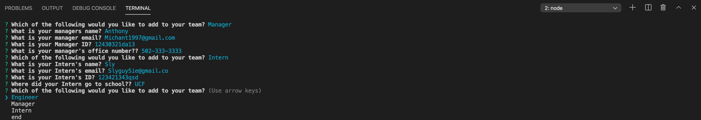

# Empolyee Summary
  

## Description
This is a command line application which is designed to be ran in the node environment. The application will prompt users for information about the team manager and then information about the team members. The user can input any number of team members, and they may be a mix of any of the possible selections. 

## Table of Contents
* [Description](#Description)
* [Installation](#Installation)
* [Usage](#Usage)
* [Licensing](#License)
* [Contributions](#Contributions)
* [Testing](#Tests)

## Installation

```
npm install
```

## Usage

Feel free to check out this demo of the application! https://drive.google.com/file/d/1afQe4ZkIIolGT6zfT8vGa3ubpsKu1_Ln/view



## License
MIT

## Contributions
Myself, W3Schools, MDN Docs, UCF Coding Bootcamp

## Tests
```
npm run test
```

## Questions 
You can click the following link to be taken to my GitHub profile: (http://github.com./EpicGibbon)


Feel free to reach out to me with any questions or comments: [mailto:Michant1997@gmail.com]